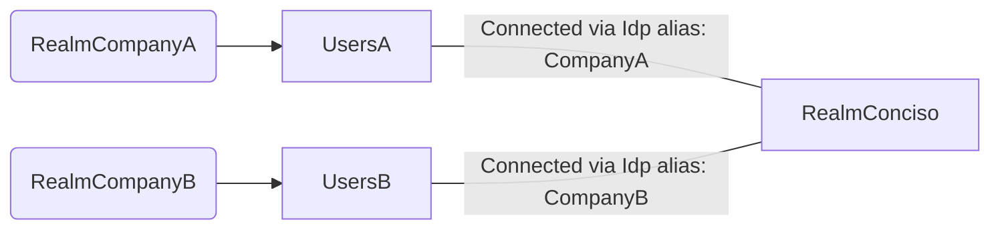

# Authenticator-Required-Action
Imagine a user authenticates via an Identity Provider (IdP) and requires a specific action, such as resetting their password or agreeing to new terms of service.
This extension ensures that the configured required action is automatically set for the user once they authenticate through the Identity Provider.

The First Broker login of Idp CompanyA is configured to set the 'TERMS_AND_CONDITIONS' for all users from CompanyA. Users from CompanyB dont have to accept the terms, so they dont get that action.

## How to use

To see your available Required-Actions, go to Realm 'master' -> Provider info -> Search for 'req' or scroll down until you see 'required-action' in the column for SPI

