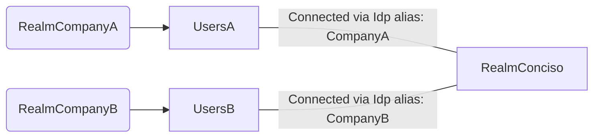
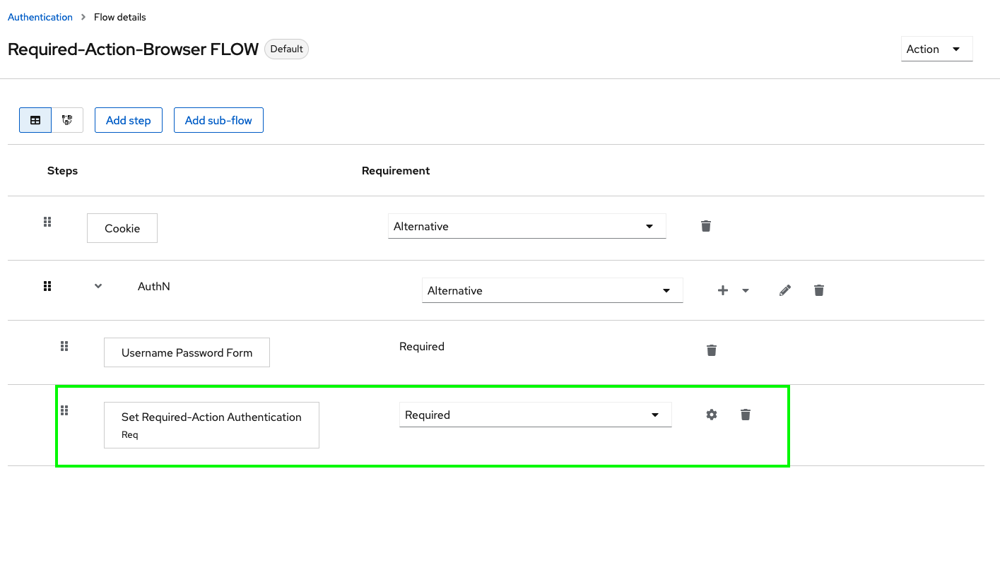
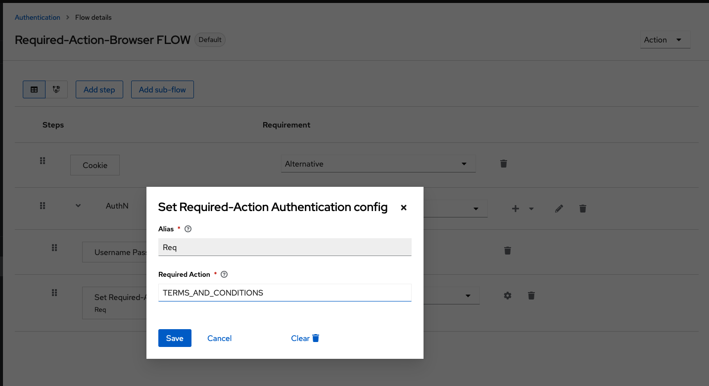
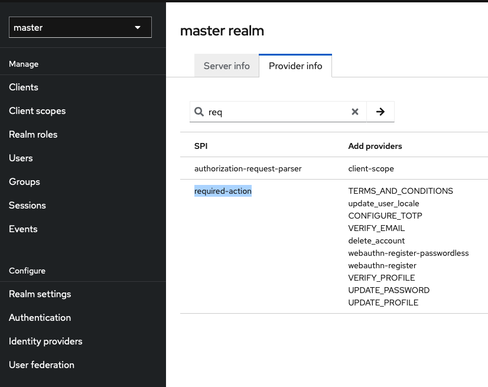

# Authenticator-Required-Action

The First Broker login of Idp CompanyA is configured to set the 'TERMS_AND_CONDITIONS' for all users from CompanyA. Users from CompanyB dont have to accept the terms, so they dont get that action.

To see your availabaddle Required-Actions, go to Realm 'master' -> Provider infor -> Search for 'req' or scroll down until you see 'required-action' in the column for SPI

